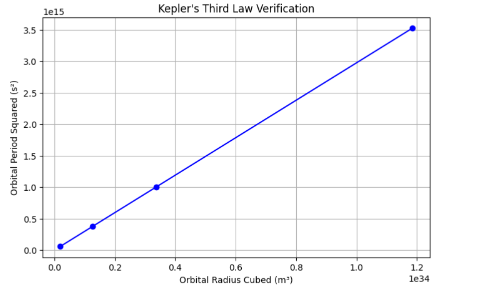

# Gravity – Problem 1  
**Orbital Period and Orbital Radius**

.
---

**Motivation**

The relationship between the square of the orbital period and the cube of the orbital radius, known as Kepler's Third Law, is a cornerstone of celestial mechanics.

This simple yet profound law allows scientists to determine planetary motion, understand satellite orbits, and analyze cosmic systems governed by gravity.

---

**Theory**

From Newton's law of gravitation and centripetal force:

$$
\frac{G M m}{r^2} = \frac{m v^2}{r}
$$

Solving for \( v \):

$$
v = \sqrt{\frac{G M}{r}}
$$

The orbital period \( T \) is the time taken to complete one orbit:

$$
T = \frac{2\pi r}{v}
$$

Substituting \( v \):

$$
T = 2\pi \sqrt{\frac{r^3}{G M}}
$$

Squaring both sides:

$$
T^2 = \frac{4\pi^2}{G M} \cdot r^3
$$

This is Kepler’s Third Law in Newtonian form.

---

**Python Simulation**

```python
import numpy as np
import matplotlib.pyplot as plt

G = 6.67430e-11      # Gravitational constant (m^3/kg/s^2)
M = 1.989e30         # Mass of the Sun (kg)

radii = np.array([5.79e10, 1.08e11, 1.50e11, 2.28e11])  # Orbital radii (m)
periods = 2 * np.pi * np.sqrt(radii**3 / (G * M))       # Periods (s)

plt.figure(figsize=(8,5))
plt.plot(radii**3, periods**2, 'o-', color='blue')
plt.xlabel("Orbital Radius Cubed (m³)")
plt.ylabel("Orbital Period Squared (s²)")
plt.title("Kepler's Third Law Verification")
plt.grid(True)
plt.show()
```

