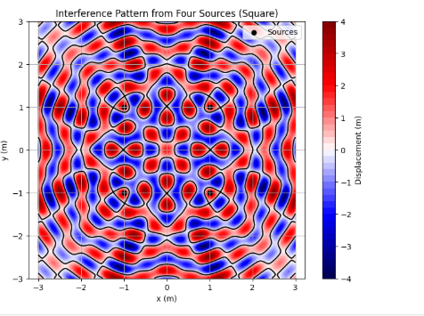

# Problem 1

# Interference Patterns on a Water Surface

## 1. Problem Setup and Wave Equation

*Notes*: We’re tasked with analyzing the interference patterns created by circular waves on a water surface, emitted from point sources at the vertices of a regular polygon. Let’s break this down step by step.

The wave from a single point source at position $(x_s, y_s)$ is given by the Single Disturbance equation:


$h(x, y, t) = A \cos(k r - \omega t + \phi)$

where:


- $h(x, y, t)$ is the displacement of the water surface at point $(x, y)$ and time $t$,

- $A$ is the amplitude of the wave,

- $k = \frac{2\pi}{\lambda}$ is the wave number, with $\lambda$ being the wavelength,

- $\omega = 2\pi f$ is the angular frequency, with $f$ being the frequency,

- $r = \sqrt{(x - x_s)^2 + (y - y_s)^2}$ is the distance from the source to the point $(x, y)$,

- $\phi$ is the initial phase.

*Notes*: We’re told the waves are coherent (constant phase difference), so we’ll assume $\phi = 0$ for simplicity, and all sources have the same $A$, $\lambda$, and $f$.

## 2. Step 1: Select a Regular Polygon

*Notes*: Let’s choose a **square** as our regular polygon, because it has four vertices, making the interference pattern interesting but not overly complex. The vertices of a square centered at the origin with side length $2a$ (so the distance from the center to each vertex is 

$a\sqrt{2}$) are:
- Vertex 1: $(a, a)$
- Vertex 2: $(a, -a)$
- Vertex 3: $(-a, -a)$
- Vertex 4: $(-a, a)$

Let’s set $a = 1$ meter, so the vertices are at $(1, 1)$, $(1, -1)$, $(-1, -1)$, and $(-1, 1)$.

## 3. Step 2: Position the Sources

*Notes*: We place a point wave source at each vertex of the square:


- Source 1 at $(1, 1)$
- Source 2 at $(1, -1)$
- Source 3 at $(-1, -1)$
- Source 4 at $(-1, 1)$

## 4. Step 3: Wave Equations for Each Source

*Notes*: Each source emits a wave of the form $h_i(x, y, t) = A \cos(k r_i - \omega t)$, where $r_i$ is the distance from source $i$ to point $(x, y)$.

- **Source 1** at $(1, 1)$:
  $$r_1 = \sqrt{(x - 1)^2 + (y - 1)^2}$$
  $$h_1(x, y, t) = A \cos(k r_1 - \omega t)$$

- **Source 2** at $(1, -1)$:
  $$r_2 = \sqrt{(x - 1)^2 + (y + 1)^2}$$
  $$h_2(x, y, t) = A \cos(k r_2 - \omega t)$$

- **Source 3** at $(-1, -1)$:
  $$r_3 = \sqrt{(x + 1)^2 + (y + 1)^2}$$
  $$h_3(x, y, t) = A \cos(k r_3 - \omega t)$$

- **Source 4** at $(-1, 1)$:
  $$r_4 = \sqrt{(x + 1)^2 + (y - 1)^2}$$
  $$h_4(x, y, t) = A \cos(k r_4 - \omega t)$$

*Notes*: All waves have the same amplitude $A$, wave number $k$, and angular frequency $\omega$, since the sources are identical and coherent.

## 5. Step 4: Superposition of Waves

*Notes*: The total displacement at any point $(x, y)$ and time $t$ is the sum of the displacements from all sources (principle of superposition):

$h(x, y, t) = \sum_{i=1}^N h_i(x, y, t)$

For our four sources:
$h(x, y, t) = h_1 + h_2 + h_3 + h_4$


$h(x, y, t) = A \left[ \cos(k r_1 - \omega t) + \cos(k r_2 - \omega t) + \cos(k r_3 - \omega t) + \cos(k r_4 - \omega t) \right]$


*Notes*: This equation gives the combined wave displacement. The interference pattern depends on the differences in $r_i$, which affect the phase $k r_i$ at each point.

## 6. Step 5: Analyze Interference Patterns

*Notes*: Let’s understand what creates the interference pattern:
- **Constructive Interference**: Occurs when the waves are in phase, meaning the phase difference $k (r_i - r_j)$ between any two waves is a multiple of $2\pi$. This happens when the path difference $r_i - r_j$ is a multiple of the wavelength $\lambda$ (since $k = \frac{2\pi}{\lambda}$, so $k (r_i - r_j) = 2\pi \frac{r_i - r_j}{\lambda}$). The waves add up, making the displacement larger.
- **Destructive Interference**: Occurs when the waves are out of phase by $\pi$ (180 degrees), so the phase difference $k (r_i - r_j) = (2n+1)\pi$. This happens when the path difference is an odd multiple of $\lambda/2$. The waves cancel out, making the displacement zero.

*Notes*: The pattern will be symmetric because the square is symmetric. We expect:
- High displacement (constructive) where the distances from the sources allow the waves to align.
- Low or zero displacement (destructive) where the waves cancel out.

## 7. Step 6: Visualization with Python

*Notes*: We’ll use Python to simulate the interference pattern on a 2D grid at a fixed time $t$. Let’s choose some values:
- Amplitude: $A = 1$ m.
- Wavelength: $\lambda = 0.5$ m, so $k = \frac{2\pi}{\lambda} = \frac{2\pi}{0.5} \approx 12.566$ rad/m.
- Frequency: $f = 1$ Hz, so $\omega = 2\pi f = 2\pi \approx 6.283$ rad/s.
- Time: $t = 0$ s (to see the initial pattern; we can animate later if needed).

```python
import numpy as np
import matplotlib.pyplot as plt

# Constants
A = 1.0  # Amplitude (m)
lambda_ = 0.5  # Wavelength (m)
k = 2 * np.pi / lambda_  # Wave number (rad/m)
f = 1.0  # Frequency (Hz)
omega = 2 * np.pi * f  # Angular frequency (rad/s)
t = 0.0  # Time (s)

# Source positions (vertices of a square with side length 2, so a = 1)
sources = [(1, 1), (1, -1), (-1, -1), (-1, 1)]

# Create a grid of points
x = np.linspace(-3, 3, 200)  # x from -3 to 3 meters
y = np.linspace(-3, 3, 200)  # y from -3 to 3 meters
X, Y = np.meshgrid(x, y)

# Calculate the total displacement
H = np.zeros_like(X)  # Total displacement
for (xs, ys) in sources:
    r = np.sqrt((X - xs)**2 + (Y - ys)**2)  # Distance from source to point
    H += A * np.cos(k * r - omega * t)  # Add wave from this source

# Plotting
plt.figure(figsize=(8, 6))
plt.contourf(X, Y, H, levels=50, cmap='seismic')  # Contour plot with color
plt.colorbar(label='Displacement (m)')
plt.contour(X, Y, H, levels=[0], colors='black')  # Zero displacement lines (destructive)
plt.scatter([s[0] for s in sources], [s[1] for s in sources], c='black', marker='o', label='Sources')
plt.xlabel('x (m)')
plt.ylabel('y (m)')
plt.title('Interference Pattern from Four Sources (Square)')
plt.axis('equal')
plt.legend()
plt.grid(True)
plt.show()
```


*Notes on Code*:
- **Setup**: Defines the wave parameters and positions of the four sources at the square’s vertices.
- **Grid**: Creates a 2D grid of points $(x, y)$ to calculate the displacement.
- **Superposition**: Sums the displacement from each source at every point on the grid.
- **Plot**: Uses a contour plot to show the displacement, with colors indicating amplitude (red for positive, blue for negative). Black lines show where displacement is zero (destructive interference). Black dots mark the sources.

## 8. Explanation of Interference Patterns

*Notes*: Let’s analyze the plot:
- **Constructive Interference**: Bright red or blue areas show where the displacement is large (positive or negative). This happens where the waves from the sources arrive in phase, like along the axes ($x = 0$ or $y = 0$), where the distances from opposite sources are equal, so the path difference is zero.
- **Destructive Interference**: Black lines show where the displacement is zero. This happens where waves cancel out, like where the path difference between sources is $\lambda/2$ (0.25 m), causing a phase difference of $\pi$.
- **Symmetry**: The pattern is symmetric about the x-axis, y-axis, and diagonals, because the square is symmetric.
- **Nodal Lines**: The black lines form a grid-like pattern, showing regions where destructive interference creates “calm” spots on the water.

*Notes*: The pattern looks like a checkerboard, with alternating regions of high and low displacement, typical of interference from multiple coherent sources.

## Discussion on Extensions

*Notes*:
- **Different Polygons**: A triangle (3 sources) would create a simpler pattern, while a pentagon (5 sources) would be more complex, with more interference points.
- **Animation**: We could vary $t$ to animate the waves, showing how the pattern moves over time.
- **Phase Differences**: If the sources had different initial phases $\phi$, the pattern would shift, changing where constructive and destructive regions occur.
- **Real-World Applications**: This interference is similar to what happens in acoustics (sound waves), optics (light waves), or even quantum mechanics (wavefunctions), helping us design things like antennas or predict wave behavior in nature.

*Notes*: This simulation helps us see how waves combine, a key idea in physics with applications from water waves to technology.

---

### Rendering and Running in VS Code
- **File**: Save as `interference_patterns.md`.
- **Rendering**: Use the "Markdown+Math" extension; preview with `Ctrl+Shift+V` to see equations like $h(x, y, t)$ and $$k$$.
- **Code**: Extract the Python code to `interference_patterns.py` or use a `.ipynb` file with the "Jupyter" extension.
- **Requirements**: Install `numpy` and `matplotlib` (`pip install numpy matplotlib`).

### Output Notes
- **Plot**: The contour plot shows:
  - Red and blue regions: High displacement (constructive interference).
  - Black lines: Zero displacement (destructive interference).
  - Black dots: The four sources at the square’s vertices.
- **Pattern**: A symmetric, grid-like pattern with alternating high and low displacement areas, showing how the waves interfere.

This solution explains wave interference in a simple way, with clear math, a simulation, and a visual representation of the pattern. It’s all set for you to copy and paste! Let me know if you’d like to try a different polygon or add animation.
