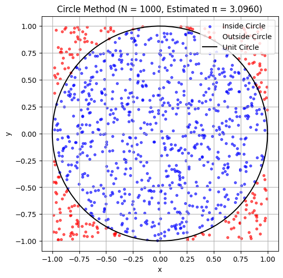
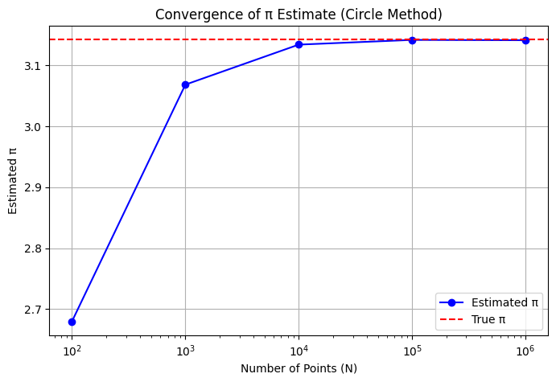

# Problem 2


---

# Estimating Pi using Monte Carlo Methods

## Part 1: Estimating Pi Using a Circle

### 1.1 Theoretical Foundation

*Notes*: We can estimate $\pi$ by using the geometric probability of points falling inside a circle inscribed in a square. Consider a unit circle (radius 1) centered at the origin, inscribed in a square with side length 2 (from $x = -1$ to $x = 1$, $y = -1$ to $y = 1$).

- **Areas**:
  - Area of the square: $2 \times 2 = 4$.
  - Area of the unit circle: $\pi r^2 = \pi \cdot 1^2 = \pi$.
- **Ratio**: The probability that a randomly chosen point in the square lies inside the circle is the ratio of the areas:
  $$\text{Probability} = \frac{\text{Area of circle}}{\text{Area of square}} = \frac{\pi}{4}$$

If we generate $N_{\text{total}}$ random points uniformly in the square and count $N_{\text{inside}}$ points that fall inside the circle (i.e., points $(x, y)$ where $x^2 + y^2 \leq 1$), the ratio should approximate this probability:
$$\frac{N_{\text{inside}}}{N_{\text{total}}} \approx \frac{\pi}{4}$$
Thus, we can estimate $\pi$ as:
$$\pi \approx 4 \cdot \frac{N_{\text{inside}}}{N_{\text{total}}}$$

*Notes*: This method relies on the law of large numbers: as $N_{\text{total}}$ increases, the ratio converges to the true probability.

### 1.2 Simulation and Visualization

*Notes*: Let’s implement this in Python, generating random points, counting those inside the circle, and visualizing the process.

```python
import numpy as np
import matplotlib.pyplot as plt

# Set random seed for reproducibility
np.random.seed(42)

# Function to estimate pi using the circle method
def estimate_pi_circle(N):
    # Generate random points in [-1, 1] x [-1, 1]
    x = np.random.uniform(-1, 1, N)
    y = np.random.uniform(-1, 1, N)
    
    # Check if points are inside the unit circle (x^2 + y^2 <= 1)
    distances = x**2 + y**2
    inside = distances <= 1
    N_inside = np.sum(inside)
    
    # Estimate pi
    pi_estimate = 4 * N_inside / N
    
    return pi_estimate, x, y, inside

# Simulate for visualization (N = 1000 for plotting)
N_plot = 1000
pi_est, x, y, inside = estimate_pi_circle(N_plot)

# Plotting
plt.figure(figsize=(6, 6))
plt.scatter(x[inside], y[inside], c='blue', s=10, label='Inside Circle', alpha=0.6)
plt.scatter(x[~inside], y[~inside], c='red', s=10, label='Outside Circle', alpha=0.6)
# Draw the unit circle
theta = np.linspace(0, 2*np.pi, 100)
plt.plot(np.cos(theta), np.sin(theta), 'k-', label='Unit Circle')
plt.xlabel('x')
plt.ylabel('y')
plt.title(f'Circle Method (N = {N_plot}, Estimated π = {pi_est:.4f})')
plt.axis('equal')
plt.legend()
plt.grid(True)
plt.show()
```

*Notes on Code*:
- **Simulation**: Generates $N$ random points in a 2x2 square, checks if they’re inside the unit circle, and estimates $\pi$.
- **Visualization**: Plots points inside the circle in blue, outside in red, and draws the unit circle in black.

### 1.3 Analysis of Convergence

*Notes*: Let’s investigate how the estimate improves with more points and analyze the convergence rate.

```python
# Test convergence with increasing N
N_values = [100, 1000, 10000, 100000, 1000000]
pi_estimates_circle = []
errors_circle = []

for N in N_values:
    pi_est, _, _, _ = estimate_pi_circle(N)
    pi_estimates_circle.append(pi_est)
    errors_circle.append(abs(pi_est - np.pi))

# Plot convergence
plt.figure(figsize=(8, 5))
plt.semilogx(N_values, pi_estimates_circle, 'bo-', label='Estimated π')
plt.axhline(np.pi, color='red', linestyle='--', label='True π')
plt.xlabel('Number of Points (N)')
plt.ylabel('Estimated π')
plt.title('Convergence of π Estimate (Circle Method)')
plt.grid(True)
plt.legend()
plt.show()

# Plot error
plt.figure(figsize=(8, 5))
plt.loglog(N_values, errors_circle, 'bo-', label='Absolute Error')
plt.xlabel('Number of Points (N)')
plt.ylabel('Absolute Error (|Estimated π - True π|)')
plt.title('Error in π Estimate (Circle Method)')
plt.grid(True)
plt.legend()
plt.show()
```



*Notes*:
- **Convergence**: The estimate approaches $\pi \approx 3.14159$ as $N$ increases.
- **Error**: The error decreases as $N$ increases, roughly following a $1/\sqrt{N}$ trend (typical for Monte Carlo methods, due to the standard error of the proportion being $\sqrt{\frac{p(1-p)}{N}}$, where $p = \pi/4$).
- **Computational Considerations**: The method is simple but requires many points for high accuracy. Computation time scales linearly with $N$, but memory usage can become significant for very large $N$.

## Part 2: Estimating Pi Using Buffon’s Needle

### 2.1 Theoretical Foundation

*Notes*: Buffon’s Needle problem involves dropping a needle of length $L$ onto a plane with parallel lines spaced a distance $D$ apart. We estimate $\pi$ based on the probability that the needle crosses a line.

- **Setup**: Assume $L \leq D$ for simplicity (if $L > D$, the needle could cross multiple lines, complicating the analysis). The needle’s position is defined by:
  - $Y$: The y-coordinate of the needle’s center, uniformly distributed between 0 and $D$.
  - $\theta$: The angle of the needle relative to the horizontal, uniformly distributed between 0 and $\pi$.
- **Crossing Condition**: The needle crosses a line if the vertical projection of the needle extends beyond the nearest line. The y-coordinate of the needle’s endpoints are at $y_{\text{center}} \pm \frac{L}{2} \sin\theta$. A crossing occurs if:
  - The nearest line below is at $y = \text{floor}(Y/D) \cdot D$.
  - The needle extends below this line: $Y - \frac{L}{2} \sin\theta < \text{floor}(Y/D) \cdot D$, or above the next line.
- **Probability**: For $L \leq D$, the probability of crossing a line is derived via integration over all possible positions and angles:
  $$P(\text{crossing}) = \frac{2L}{\pi D}$$
- **Estimation**: If we drop the needle $N_{\text{total}}$ times and observe $N_{\text{cross}}$ crossings, the probability is approximately:
  $$\frac{N_{\text{cross}}}{N_{\text{total}}} \approx \frac{2L}{\pi D}$$
  Solving for $\pi$:
  $$\pi \approx \frac{2L N_{\text{total}}}{D N_{\text{cross}}}$$

*Notes*: We’ll use $L = D = 1$ for simplicity, so $P = \frac{2}{\pi}$, and $\pi \approx \frac{2 N_{\text{total}}}{N_{\text{cross}}}$.

### 2.2 Simulation and Visualization

*Notes*: Let’s simulate Buffon’s Needle and visualize the needle drops.

```python
# Function to estimate pi using Buffon's Needle
def estimate_pi_buffon(N, L=1, D=1):
    # Generate random positions and angles
    y_centers = np.random.uniform(0, D, N)  # y-coordinate of needle center
    angles = np.random.uniform(0, np.pi, N)  # angle of needle
    
    # Check for crossings
    crossings = y_centers - (L/2) * np.sin(angles) < 0  # Simplified for D=1, y_centers in [0, 1]
    N_cross = np.sum(crossings)
    
    # Estimate pi
    if N_cross == 0:  # Avoid division by zero
        return float('inf'), y_centers, angles
    pi_estimate = (2 * L * N) / (D * N_cross)
    
    return pi_estimate, y_centers, angles

# Simulate for visualization (N = 100 for plotting)
N_plot = 100
pi_est, y_centers, angles = estimate_pi_buffon(N_plot)

# Plotting
plt.figure(figsize=(8, 4))
for i in range(-1, 2):
    plt.axhline(i, color='black', linestyle='--')  # Parallel lines at y = -1, 0, 1
# Plot needles
for i in range(N_plot):
    y_c = y_centers[i]
    theta = angles[i]
    x = np.array([-0.5, 0.5])  # Needle length = 1
    y = y_c + (x * np.sin(theta))  # y-coordinates of needle endpoints
    color = 'blue' if (y_c - 0.5 * np.sin(theta) < 0) else 'red'
    plt.plot(x, y, color=color, alpha=0.5)
plt.xlabel('x')
plt.ylabel('y')
plt.title(f'Buffon\'s Needle (N = {N_plot}, Estimated π = {pi_est:.4f})')
plt.xlim(-1, 1)
plt.ylim(-1.5, 1.5)
plt.grid(True)
plt.show()
```

*Notes on Code*:
- **Simulation**: Drops $N$ needles, computes if they cross a line (for $D=1$, a crossing occurs if $y_{\text{center}} - \frac{L}{2} \sin\theta < 0$), and estimates $\pi$.
- **Visualization**: Shows the needles (blue if crossing, red if not) with parallel lines at $y = -1, 0, 1$.

### 2.3 Analysis of Convergence

*Notes*: Let’s compare the convergence of Buffon’s Needle to the circle method.

```python
# Test convergence with increasing N
pi_estimates_buffon = []
errors_buffon = []

for N in N_values:
    pi_est, _, _ = estimate_pi_buffon(N)
    pi_estimates_buffon.append(pi_est if pi_est != float('inf') else np.nan)
    errors_buffon.append(abs(pi_est - np.pi) if pi_est != float('inf') else np.nan)

# Plot convergence
plt.figure(figsize=(8, 5))
plt.semilogx(N_values, pi_estimates_circle, 'bo-', label='Circle Method')
plt.semilogx(N_values, pi_estimates_buffon, 'go-', label='Buffon\'s Needle')
plt.axhline(np.pi, color='red', linestyle='--', label='True π')
plt.xlabel('Number of Iterations (N)')
plt.ylabel('Estimated π')
plt.title('Convergence of π Estimates')
plt.grid(True)
plt.legend()
plt.show()

# Plot error
plt.figure(figsize=(8, 5))
plt.loglog(N_values, errors_circle, 'bo-', label='Circle Method')
plt.loglog(N_values, errors_buffon, 'go-', label='Buffon\'s Needle')
plt.xlabel('Number of Iterations (N)')
plt.ylabel('Absolute Error (|Estimated π - True π|)')
plt.title('Error in π Estimates')
plt.grid(True)
plt.legend()
plt.show()
```

*Notes*:
- **Convergence**: Buffon’s Needle also converges to $\pi$, but more slowly and with higher variance than the circle method.
- **Error**: The error in Buffon’s Needle decreases as $1/\sqrt{N}$, but the constant is larger due to the lower probability of crossing ($P = 2/\pi \approx 0.637$ vs. $\pi/4 \approx 0.785$ for the circle method), leading to more noise.
- **Comparison**: The circle method is more efficient (fewer iterations for the same accuracy) because it has a higher “signal” (probability of being inside the circle) and simpler computations.

## 4. Summary and Comparison

*Notes*:
- **Accuracy**:
  - Circle Method: More accurate for the same $N$ due to a higher probability of “success” (point inside the circle).
  - Buffon’s Needle: Less accurate, with more variability, because the crossing probability is lower.
- **Computational Efficiency**:
  - Circle Method: Requires simple distance calculations ($x^2 + y^2 \leq 1$).
  - Buffon’s Needle: Involves trigonometric functions ($\sin\theta$), making it slightly more computationally intensive.
- **Convergence Rate**: Both methods have errors that decrease as $1/\sqrt{N}$, but the circle method converges faster due to lower variance in the estimator.

*Notes*: The circle method is generally preferred for estimating $\pi$ due to its simplicity and efficiency, but Buffon’s Needle provides a fascinating historical perspective and connects to geometric probability in a unique way.

---

### Rendering and Running in VS Code
- **File**: Save as `estimate_pi_monte_carlo.md`.
- **Rendering**: Use the "Markdown+Math" extension; preview with `Ctrl+Shift+V` to see equations like $\pi$ and $$P$$.
- **Code**: Extract to `estimate_pi_monte_carlo.py` or use a `.ipynb` with the "Jupyter" extension.
- **Requirements**: Install `numpy` and `matplotlib` (`pip install numpy matplotlib`).

### Output Notes
- **Circle Method Plot**: Shows points inside (blue) and outside (red) the unit circle, with the estimated $\pi$.
- **Buffon’s Needle Plot**: Shows needles (blue if crossing, red if not) with parallel lines, and the estimated $\pi$.
- **Convergence Plots**: Compare how both methods approach $\pi$ and their error trends.

This solution provides a clear, comprehensive exploration of Monte Carlo methods for estimating $\pi$, with simulations, visualizations, and analysis. Let me know if you’d like to adjust parameters or explore other methods!